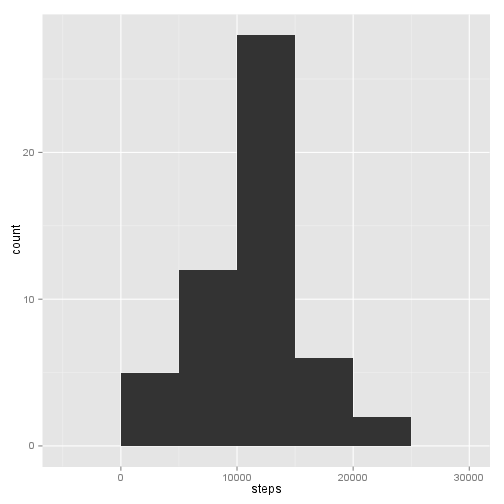
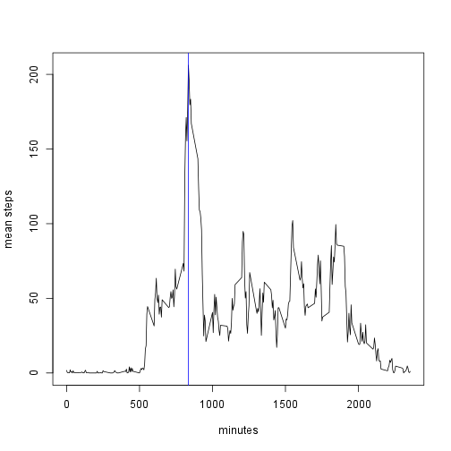
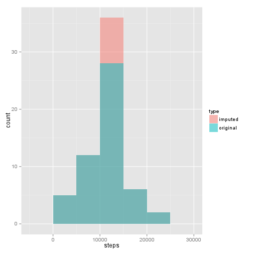
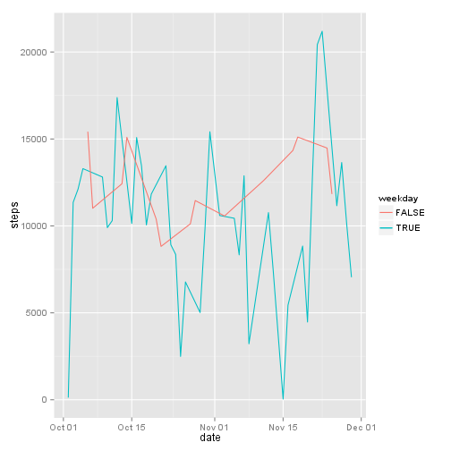

## Loading and preprocessing the data

```r
activity <- read.csv("activity.csv",colClasses = c("integer","Date","integer"))
```


## What is mean total number of steps taken per day?

```r
library(ggplot2)
daily <- aggregate(steps ~ date, data = activity,sum)
mn <- mean(daily$steps)
md <- median(daily$steps)
ggplot(daily,aes(steps,fill=date)) + geom_histogram(binwidth=5000,position = "identity")
```

 

Mean: 10766.19

Median: 10765

## What is the average daily activity pattern?

```r
timeseries <- aggregate(steps ~ interval, data = activity,mean)
maxavg <- timeseries[timeseries$steps == max(timeseries$steps),]
plot(timeseries$interval,timeseries$steps,type="l",xlab="minutes",ylab="mean steps")
abline(v=maxavg$interval,lw=1,col="blue")
```

 

Max average steps 206.1698113 found for interval 835 - 839

## Imputing missing values

```r
imputed <- activity

impute <- function(steps,interval){
  timeseries[timeseries$interval == interval,c('steps')]
}
func <- function(x){
  r <- impute(as.numeric(x['steps']),as.integer( x['interval']))
  r
}

imputed[which(is.na(imputed$steps)),]$steps <- apply(imputed[which(is.na(imputed$steps)),],1,func)

dailyimputed <- aggregate(steps ~ date, data = imputed,sum)
mn <- mean(dailyimputed$steps)
md <- median(dailyimputed$steps)
daily$type = "original"
dailyimputed$type = "imputed"
combined <- rbind(daily,dailyimputed)
ggplot(combined,aes(steps,fill=type)) + geom_histogram(alpha=0.5,binwidth=5000,position = "identity")
```

 


Mean: 10766.19

Median: 10766.19

Imputed NA values as the mean steps for the given interval.

While the histograms look very similar with the imputed values and the mean is unchanged, the medians observed are different between the original dataset and the dataset with imputed steps values. Observing closely, it is clear that the graphs are not similar. Imputed dataset seems to have higher counts in 10000 - 15000 bin than the original dataset. Counts in other bins in imputed dataset is unchanged.

## Are there differences in activity patterns between weekdays and weekends?

```r
daily$weekday <- !(weekdays(daily$date) %in% c("Saturday","Sunday"))

wkday <- daily[daily$weekday,]
wkend <- daily[!daily$weekday,]
ggplot() + geom_line(aes(x = date,y = steps,color=weekday),wkday) + geom_line(aes(x = date, y = steps,color=weekday),wkend)
```

 

Activity varies a lot during the weekdays from very low to very high but varies very little during the weekends.
